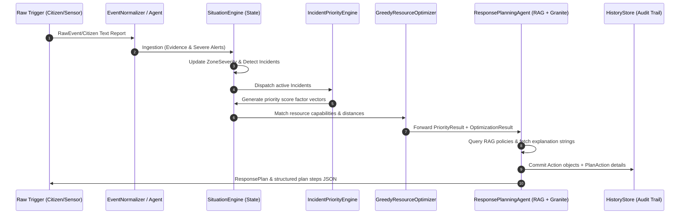
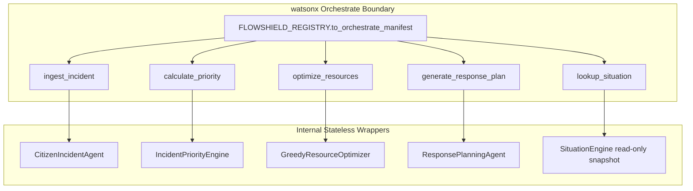

# FlowShield V1 Architecture Audit Report
## Gujarat Hackathon 2026 (Challenge 7)

This audit documents the current baseline implementation of **FlowShield V1**, a modular agentic urban flood situation and decision-support platform designed to operate under strict deterministic guidelines while utilizing IBM Granite for explanation and policy-grounded response advice.

---

## 1. Current Repository Tree

Below is the verified structural layout of the FlowShield V1 codebase:

```text
flowshield/
├── pyproject.toml              # Build system, dependencies (Pydantic v2, pytest, ruff)
├── README.md                   # Project summary, architecture blueprint
├── AGENTS.md                   # Developer rules, enums, constraints, templates
├── task_plan.md                # Audit execution roadmap
├── findings.md                 # This comprehensive architecture audit report
├── progress.md                 # Session-by-session execution notes
├── scripts/
│   ├── run_workflow.py         # End-to-end multi-stage deterministic pipeline test execution
│   └── serve_dashboard.py      # HTTP server serving static assets and mocking simulations
├── tests/                      # Pytest suite (17 files, 586 passing tests)
│   ├── test_action.py
│   ├── test_citizen_agent.py
│   ├── test_engine_drain.py
│   ├── test_engine_rainfall.py
│   ├── test_engine_resource.py
│   ├── test_engine_waterlogging.py
│   ├── test_evidence.py
│   ├── test_incident.py
│   ├── test_knowledge_layer.py
│   ├── test_optimizer.py
│   ├── test_orchestrate.py
│   ├── test_outcome.py
│   ├── test_priority_engine.py
│   ├── test_reasoning.py
│   ├── test_resource.py
│   ├── test_response_planning_agent.py
│   └── test_situation.py
└── src/
    ├── models/                 # Stable Pydantic v2 domain models
    │   ├── __init__.py
    │   ├── action.py
    │   ├── event.py
    │   ├── evidence.py
    │   ├── incident.py
    │   ├── outcome.py
    │   ├── resource.py
    │   └── situation.py
    ├── engine/                 # Deterministic execution core
    │   ├── __init__.py
    │   ├── detector.py
    │   ├── engine.py
    │   ├── history.py
    │   ├── ingestor.py
    │   ├── normalizer.py
    │   ├── optimizer.py
    │   ├── optimizer_request.py
    │   ├── optimizer_result.py
    │   ├── priority_config.py
    │   ├── priority_context.py
    │   ├── priority_engine.py
    │   ├── priority_result.py
    │   └── resource_updater.py
    ├── reasoning/              # IBM Granite instruction extraction and prompt layer
    │   ├── __init__.py
    │   ├── granite_client.py
    │   ├── prompt_templates.py
    │   ├── reasoning_layer.py
    │   └── reasoning_result.py
    ├── knowledge/              # Grounding corpus (RAG) and BM25 index
    │   ├── __init__.py
    │   ├── documents.py
    │   ├── knowledge_base.py
    │   └── knowledge_chunk.py
    ├── agents/                 # Pydantic-based planning logic & report parsing
    │   ├── __init__.py
    │   ├── citizen_report_parser.py
    │   ├── citizen_incident_agent.py
    │   ├── policy_config.py
    │   ├── response_plan.py
    │   └── response_planning_agent.py
    ├── orchestrate/            # watsonx Orchestrate stateless tools boundary
    │   ├── __init__.py
    │   ├── registry.py
    │   ├── scenario_runner.py
    │   ├── tool_contracts.py
    │   └── tools.py
    ├── workflow/               # Multi-stage process manager
    │   ├── __init__.py
    │   ├── scenario_ward12.py
    │   ├── workflow.py
    │   └── workflow_result.py
    └─ dashboard/               # Frontend assets
        ├── index.html
        ├── script.js
        └── style.css
```

---

## 2. V1 Runtime Architecture

FlowShield operates via a clear decoupling of **deterministic pipelines** (ingestion, prioritization, optimization) and **agentic advisory loops** (explanations, policy checks). The following runtime sequence outlines data flows:

### 2.1 Runtime Data Flow


- **Safety Bounds (Granite Advisor):** The AI can *explain* and *ground* decision pathways, but it is architecturally blocked from modifying priority ranking values, overriding optimization allocations, or inventing assets and resources.

---

## 3. Core Domain Models

Every domain model is compiled using **Pydantic v2** with strict configuration validation via `extra="forbid"`, which enforces compile-time schema compliance and prevents schema leakage.

### 3.1 Overview of Domain Contracts

| Model | Module | Primary Fields | Key Validations & Constraints |
|---|---|---|---|
| `Evidence` | `src/models/evidence.py` | `id`, `city`, `zone_id`, `source`, `observed_at`, `rainfall_mm_hr`, `water_level_m`, `affected_population`, `road_blocked`, `raw` | Enforces **at least one measurement field** at initialization. Strips whitespace from `city` and `zone_id`. Sets `road_blocked` explicitly (cannot be overridden to null). |
| `SituationState` | `src/models/situation.py` | `id`, `city`, `zones`, `updated_at` | Tracks `ZoneStatus` records mapping `zone_id` string index. Computes overall severity dynamically. |
| `Incident` | `src/models/incident.py` | `id`, `city`, `zone_id`, `severity`, `risk_score`, `title`, `description`, `status`, `evidence_ids` | Validates risk scores between `0.0` and `1.0`. Enforces status transitions: `active` → `dispatched` → `resolved`. |
| `Resource` | `src/models/resource.py` | `id`, `name`, `city`, `type`, `home_zone_id`, `current_zone_id`, `capacity`, `status`, `notes` | Restricts statuses to `ResourceStatus` enums. Enforces that deployed resources **must** have `current_zone_id` specified. |
| `Action` | `src/models/action.py` | `id`, `incident_id`, `resource_id`, `decided_by`, `status`, `decision_rationale`, `dispatched_at` | Links execution agents to specific incidents. Enforces rationales are longer than 5 characters. |
| `Outcome` | `src/models/outcome.py` | `id`, `action_id`, `incident_id`, `success`, `severity_after`, `notes`, `recorded_at` | Marks execution feedback. An unsuccessful outcome (`success=False`) **must** include explanatory `notes`. |

### 3.2 Critical Constraints & Validation Rules

*   **ZoneSeverity vs SeverityLevel:** 
    *   `ZoneSeverity` levels: `normal`, `watch`, `warning`, `critical` (used inside `ZoneStatus` to assess localized risk areas).
    *   `SeverityLevel` levels: `low`, `medium`, `high`, `critical` (used inside `Incident` records).
    *   *These are separate enums and must not be cast interchangeably.*
*   **SituationState.overall_severity:** This is a read-only Python property. It computes the max severity across all active zones and is excluded from `model_dump()` to prevent mutation:
    ```python
    @property
    def overall_severity(self) -> ZoneSeverity:
        if not self.zones:
            return ZoneSeverity.NORMAL
        # Maps watch -> warning -> critical priority
    ```
*   **Measurement Guard:** In `Evidence`, a Pydantic `@model_validator(mode="before")` verifies that at least one of `rainfall_mm_hr`, `water_level_m`, `affected_population`, or `road_blocked` is provided. The validator requires passing `road_blocked` directly (e.g. `road_blocked=False` instead of converting to `None`).

---

## 4. Engine Components & Execution Pipelines

The execution engine translates raw inputs into incident vectors entirely within **deterministic, mathematical boundary layers**.

### 4.1 Ingestion & Detection Thresholds (`ingestor.py` & `detector.py`)

1.  **Normalization:** `EventNormalizer` converts unstructured events into standardized `Evidence` payloads.
2.  **Severity Evaluation:** `Ingestor` evaluates live metrics against predefined thresholds:
    *   **Rainfall thresholds:** 
        *   `> 20.0 mm/hr` → `watch`
        *   `> 35.0 mm/hr` → `warning`
        *   `> 50.0 mm/hr` → `critical`
    *   **Waterlogging thresholds:** 
        *   `> 0.2m` → `watch`
        *   `> 0.5m` → `warning`
        *   `> 0.8m` → `critical`
3.  **Risk Score Weighting:** Active incidents calculate `risk_score` deterministically within `detector.py`:
    $$\text{Risk Score} = 0.5 \times \text{Water Level Factor} + 0.3 \times \text{Population Factor} + 0.2 \times \text{Road Disruption Factor}$$
    Each factor is bounded between `0.0` and `1.0`.

### 4.2 Incident Priority Engine (`priority_engine.py`)

Prioritization is calculated using a stateless six-factor scoring matrix structured as follows:

$$\text{Priority Score} = \sum (\text{normalized\_factor\_val} \times \text{weight})$$

The six factors and their default configuration parameters inside `PriorityConfig` are:

| Factor | Weight | Evaluation Method / Scale |
|---|---|---|
| `severity` | `0.30` | Mapped from incident level: `critical=1.0`, `high=0.7`, `medium=0.4`, `low=0.1` |
| `critical_facility` | `0.20` | Count of affected hospitals/schools (scaled bounded range: `0` to `2+`) |
| `road_disruption` | `0.15` | If `road_blocked=True`, returns `1.0`; else `0.0` |
| `population_impact` | `0.15` | Logarithmic scale of affected population: $\min(1.0, \log_{10}(\text{pop}) / 4.0)$ |
| `response_deadline` | `0.10` | Urgent countdown offset: $\max(0.0, 1.0 - \text{hours} / 12.0)$ |
| `infra_dependency` | `0.10` | High-impact assets count (pumps, power grids): $\min(1.0, \text{count} / 3.0)$ |

For auditing compliance, the output is structured as a `PriorityResult` object which embeds a collection of `FactorScore` snapshots to document step-by-step priority calculation details.

### 4.3 Greedy Resource Optimizer (`optimizer.py`)

Assigns municipal assets. The resource optimizer matches prioritize incident arrays against available units:
1.  **Capability Matching:** Verifies capability compatibility:
    *   `rescue_crew` handles all incidents featuring high `population_impact` or `road_disruption`.
    *   `pump_crew` covers waterlogging where `water_level_m` exceeds `0.5m`.
    *   `utility_crew` deals with power outages and blocked drains.
2.  **Distance & Speed Scoring:** Matches units using proximity scores:
    $$\text{Fit Score} = 0.6 \times \text{Priority Score} + 0.4 \times (1.0 - \text{Travel Time} / \text{Max Travel Time})$$
3.  **V1 Optimization Boundaries:**
    *   Only matches resources marked as `AVAILABLE` or `STANDBY`.
    *   Restriced to single-resource assignment limits (Multi-resource requests default to 1).
    *   Unassigned incidents generate descriptive `UnassignedIncident` records classifying resource gaps (e.g. `UA_CAPABILITY_MISMATCH`, `UA_NO_AVAILABLE_RESOURCE`).

---

## 5. IBM Granite Integration Path

FlowShield wraps the IBM Granite interaction cycle in a resilient layer, enforcing strict output contracts and fallback guarantees.

```text
               +---------------------------+
               |  Reasoning Request Initiated |
               +---------------------------+
                             |
                  [Check Env Credentials]
                             |
              Is GRANITE_API_KEY populated?
               /                         \
            (No)                         (Yes)
             /                             \
            v                               v
+--------------------------+    +---------------------------+
| Raise GraniteUnavailable  |    | GraniteClient HTTP Call   |
| (Catches immediately)    |    +---------------------------+
+--------------------------+                  |
            |                    Response Success?
            |                       /          \
            |                    (Yes)         (No)
            v                      v             v
+--------------------------+  +----------+  +--------------------------+
|  Run Pattern-Matching    |  | Generate |  | Handle Network Exception |
|    Regex Extraction      |  | Granite  |  |   Run Fallback Parsers   |
v     Fallback Logic       |  |  Record  |  v       (Safe Return)      |
+--------------------------+  +----------+  +--------------------------+
            \                      |                      /
             \---------------------+---------------------/
                                   |
                                   v
                      +-------------------------+
                      | Complete Plan Delivered |
                      +-------------------------+
```

### 5.1 Configuration & Prompt Safety

*   **Variables:** Environment variables configured are `GRANITE_API_URL`, `GRANITE_API_KEY`, and `GRANITE_MODEL_ID` (default: `ibm/granite-3-8b-instruct`).
*   **System Prompt Protections:** Prompts configured in `prompt_templates.py` enforce boundaries to protect against hallucinations:
    ```text
    MUST NOT invent coordinates, street names, or resource IDs.
    MUST NOT modify optimization travel times.
    MUST NOT perform priority mathematical scoring calculations.
    ```

### 5.2 Decoupled Fallback Logic

When the key is missing or the external API is offline:
1.  `GraniteClient` handles standard HTTP exceptions (e.g. connection limits, timeouts) by returning deterministic fallback objects.
2.  `CitizenReportParser` extracts incident locations and rainfall measurements using a fallback pattern-matching parser.
3.  Fallback operations are identified in system logs with `ReasoningSource.FALLBACK` (rendering `[FALLBACK]` in printed output).

---

## 6. RAG Integration Path

Grounding checks utilize a lightweight memory-based retrieval engine that matches guidelines dynamically against incident contexts.

### 6.1 Keyword Indexing (BM25-style)

FlowShield implements search indexing using the python standard library:
*   **TF-IDF Indexing:** Text structures are tokenized, lowercase-filtered, and stemmed. Term frequency ($TF$) and Inverse Document Frequency ($IDF$) values are computed at startup.
*   **Synonym Weighting Scheme:** Match weights are boosted according to document fields to surface critical policies:
    *   **Tags:** `3.0x` multiplier
    *   **Title:** `2.0x` multiplier
    *   **Body:** `1.0x` multiplier
*   Keywords can be enriched via metadata lists in `documents.py` to match vocabulary variants.

### 6.2 Pre-built Reference Corpus (`documents.py`)

Contains municipal guidelines (e.g. `AHMEDABAD_DRR_SOP_2025` and `GUJARAT_FLOOD_SAFETY_MANUAL`) mapped into categories:
1.  `Evacuation Guidelines`: Actions to protect vulnerable populations.
2.  `Pumping SOPs`: Directives on draining operations.
3.  `Escalation Directives`: Rules for contacting the Emergency Operations Center (EOC).

*RAG Restriction:* These chunks must remain static. They are used for grounding explanations and must never include dynamic operational or sensor metrics.

---

## 7. watsonx Orchestrate Integration Path

The `src/orchestrate/` package exposes FlowShield's engine as five distinct **watsonx Orchestrate tools**:



### 7.1 Tool Registration & Contract Declarations
Each tool follows a strict schema structure parsed via Pydantic:

1.  `ingest_incident`:
    *   **Inputs:** `city`, `report_text`, optional `zone_id_hint`.
    *   **Outputs:** `success`, `incident_id`, `zone_id`, `severity`, `risk_score`, `warnings`, `errors`.
2.  `calculate_priority`:
    *   **Inputs:** `city`, `incident_id`, `zone_id`, `severity`, `risk_score`, `road_blocked`, `critical_facility_count`.
    *   **Outputs:** `incident_id`, `priority_score`, `priority_level`, `reason_codes`, `factor_breakdown`.
3.  `optimize_resources`:
    *   **Inputs:** `city`, `priority_results`, `resources`, `zone_of_incident`, `distances`, `max_travel_minutes`.
    *   **Outputs:** `assignments`, `unassigned_incidents`, `assigned_resource_ids`, `assignment_count`, `gap_count`.
4.  `generate_response_plan`:
    *   **Inputs:** `city`, `priority_results`, `assignments`, `unassigned_incidents`, `resources`, `use_knowledge_base`.
    *   **Outputs:** `plan_id`, `city`, `plan_actions`, `requires_human_approval`, `reasoning_summary`, `knowledge_citations`.
5.  `lookup_situation`:
    *   **Inputs:** `city`, optional collection of `zone_ids`.
    *   **Outputs:** `city`, `overall_severity`, `zones`, `critical_zone_ids`.

*Stateless Execution Guard:* If a tool encounters validation exceptions at the boundary, `ScenarioRunner` intercepts the exception and returns a failed status rather than bubble-up errors to Orchestrate.

---

## 8. Dashboard Architecture

FlowShield incorporates a real-time command dashboard designed for situational monitoring.

### 8.1 Backend Implementation (`serve_dashboard.py`)

Implemented via `http.server.BaseHTTPRequestHandler` to provide lightweight simulation serving:
*   `POST /api/ingest`: Accepts citizen text templates, runs `CitizenIncidentAgent.process()`, and registers the resulting incident.
*   `POST /api/reset`: Reloads raw scenario files (e.g. Ward 12 setups) and clears runtime state.
*   `GET /api/state`: Returns the active engine state as JSON.
*   `POST /api/dispatch`: Resolves pending alerts and dispatches resources.

### 8.2 Frontend Implementation (`index.html`, `script.js`, `style.css`)
*   **Map Simulation:** Displays zone widgets and indicates risk statuses using color-coded badges matching severity ratings.
*   **Operational Logs:** Lists active incidents alongside their calculated risk metrics and ETA values.
*   **Granite Explanations Panel:** Highlights rationale tags and grounds response advice using compiled RAG citations.

---

## 9. Test Structure & Verification Metrics

FlowShield incorporates a test suite that mocks Granite behaviors to enforce stable execution limits.

*   **Total Test Count:** **586 tests** (all passing successfully with exit code 0).
*   **Test Categories & Coverage:**
    *   **Unit Tests:** Verify individual Pydantic validators, boundary checks, and error paths.
    *   **Engine Integration Tests:** Verify state transitions, severity calculations, and optimizer choices.
    *   **Orchestrate Boundary Tests:** Verify that tools serialize input schemas properly and isolate engine dependencies.
    *   **Agent Constraint Tests:** Verify that LLM prompts fallback correctly, skip unknown assets, and retain travel time offsets.

---

## 10. State & Persistence Mechanisms

### 10.1 In-Memory Persistence Constraints

V1 manages state within in-memory structures:
*   **Memory Lifetimes:** Active objects are held in dictionary indices (`SituationEngine._zones`, `SituationEngine._incidents`, `HistoryStore._records`).
*   **Reboot Fragility:** *All runtime state is lost on server reboots or scenario resets.*
*   **V2 Database Migration Requirements:** Transitioning to a production baseline requires replacing in-memory dicts with stable repository patterns:
    *   **Data store:** PostgreSQL.
    *   **ORM layer:** SQLAlchemy.
    *   **State syncing:** Implementing transaction boundaries to persist events prior to execution.

---

## 11. IBM Cloud Deployment Status

*当前部署状态:* **RED** (Missing).
1.  **Deployment Manifests:** No files exist for container orchestration (e.g. Dockerfile, Kubernetes charts, or OpenShift yaml templates).
2.  **Environment Sync:** No automated CI/CD pipeline structures are configured to deploy tools to IBM Cloud or target instances of watsonx Orchestrate.
3.  **Credentials Resolution:** API keys are injected via local environment variable configurations.

---

## 12. V2 Technical Debt & Development Roadmap

| Module | Audit Finding | Debt Impact | V2 Resolution Strategy |
|---|---|---|---|
| **State Layer** | In-memory registries | State is lost on crashes or restarts. | Integrate standard PostgreSQL repositories via SQLAlchemy. |
| **Feedback Loop** | Outcome telemetry is unlinked | Engine cannot adjust weights based on dispatch resolutions. | Feed `Outcome` severity evaluations back into `SituationState` to recalibrate hazard alerts. |
| **Optimization** | Single-resource cap | Complex scenarios requiring multiple assets cannot be handled. | Support multiple crew assignments and capacity limits under `GreedyResourceOptimizer`. |
| **Deployment** | No containerization manifests | Deployments must be run manually from source. | Structure multi-stage Dockerfiles and configuration files for IBM Cloud Engine. |
| **GIS Integration** | Coordinates are unmapped | Rely on alphanumeric Zone labels (e.g. `W12-C`). | Embed Leaflet coordinate polygon layers mapping physical urban locations. |

---

## 13. System Pipeline Mapping

Verification status of FlowShield's primary pipeline stages of **Evidence → SituationState → Incidents → Priority/Risk → Resource Optimization → Action → Outcome**:

```text
  [Evidence]              - Ingested & normalized (GREEN)
       │
       ▼
[SituationState]          - Correctly calculated & severity indexed (GREEN)
       │
       ▼
  [Incidents]             - Detected & tracked dynamically (GREEN)
       │
       ▼
 [Priority/Risk]          - Bounded weighting math executed (GREEN)
       │
       ▼
[Resource Optimization]   - Assignments generated (GREEN)
       │
       ▼
   [Action]               - Serialized and logged (GREEN)
       │
       ▼
   [Outcome]              - Completed telemetry collected; state feedback loop is missing (RED)
```

---

## 14. Verification Summary

Review status of baseline components:

*   **Pydantic Domains:** **GREEN** (Strict contracts enforced via `extra="forbid"` limit validations).
*   **Deterministic Pipeline Execution:** **GREEN** (Verified using deterministic mathematical calculation pipelines).
*   **Orchestration boundary layer:** **GREEN** (Exposes five stateless adapters).
*   **IBM Granite client fallbacks:** **GREEN** (Confirmed resilient parsing logic).
*   **RAG indexer:** **GREEN** (Verified keyword index calculations).
*   **State persistence:** **RED** (Relying on transient in-memory memory lifetimes).
*   **Deployment configs:** **RED** (Manual runs required).
*   **Telemetry feedback loop:** **RED** (Outcomes not reflected back in active alert indices).
